<div align="center">

# ⚙️ Poyra

**Türkiye'nin açık kaynak ödeme mühendisliği platformu** — orkestrasyondan kuruşu kuruşuna ödeme muhasebesine

*Poyra "tekerlek göbeği" demektir: bütün ödeme yolları dışarıdan gelir, tek göbekte birleşir.*

[](https://github.com/Dakicksoft/poyra/actions/workflows/ci.yml)
[](LICENSE)
[](https://dotnet.microsoft.com/)
[](https://www.postgresql.org/)
[](#testler)

[Karşılaştırma](#alternatifler) · [Ekran görüntüleri](#ekran-görüntüleri) · [Özellikler](#özellikler) · [Konnektörler](#konnektörler) · [Mimari](#mimari) · [Akışlar](#akışlar) · [Kurulum](#hızlı-başlangıç-geliştirme-ortamı) · [Geliştirme](#geliştirme-rehberi) · [Yol haritası](#yol-haritası) · [Lisans](#lisans)

</div>

---

## Poyra nedir?

Poyra, işyerlerini **tek API ile** Türkiye'deki banka sanal POS'larına ve ödeme
kuruluşlarına bağlayan bir **ödeme orkestrasyonu** platformudur: akıllı yönlendirme,
kesintide otomatik yedeğe geçiş (failover), taksit/vade farkı motoru, kart saklama,
abonelik, ödeme linki ve white-label ödeme sayfası.

Ama asıl tezi orkestrasyonun bittiği yerde başlar — **ödeme muhasebesi**:

> Rakip platformlar işlemi "başarılı" olduğunda kapanmış sayar.
> Oysa işyeri için asıl sorular o anda başlar: **para gerçekten hesaba geçti mi?
> Banka, anlaşılan komisyonu mu kesti? Valör kaç gün gecikti ve bu kaç liraya mal oldu?**

Poyra her tahsilatı bankadan **alacağa** çevirir, POS ekstresi ve banka **hesap
ekstresiyle** (MT940) üç yönlü mutabakat yapar, kesilen komisyonu anlaşmayla kuruşu
kuruşuna karşılaştırır, valör gecikmesini **liraya çevirir** ve komisyon itirazını
bankadan para geri gelene kadar takip eder.


## Neden Poyra?

| | Tipik orkestrasyon | Poyra |
|---|---|---|
| Yönlendirme | "En ucuza yönlendirir" (kara kutu) | **Açıklanabilir:** kural DSL'i + görsel kurucu + geçmiş işlemlerde **simülatör** ("bu kural geçen ay X ₺ tasarruf ederdi") + her işlemde "**neden bu POS?**" gerekçesi |
| İşlem sonrası | Raporlama | **Beklenen para defteri** (bankadan alacak takibi), üç yönlü mutabakat, **komisyon denetimi** (TCMB rejimi + anlaşma ↔ ekstre), valör kaybının parasal ölçümü, itirazın kapanışa kadar izlenmesi |
| Türkiye gerçekleri | Genel geçer | Taksit + vade farkı motoru (bankacı yuvarlaması), TR Karekod (EMVCo), **maaş takvimli akıllı yeniden tahsilat** (dunning; ayın 1'i/15'i), KVKK silme ↔ VUK saklama dengesi, Türkçe 'İ' katlama, TR günü (UTC+3) raporlama, Logo/Mikro ERP fişi |
| Saha tahsilatı | Yok | **Çevrimdışı-öncelikli MAUI uygulaması:** ağsız sahada kuyruklama, yasal zaman damgası **sunucudan** |
| Denetlenebilirlik | Log | **Silinemez operasyon kütüğü:** olay defterlerinde `UPDATE/DELETE` hakkı veritabanı düzeyinde yoktur — kayıt iptal edilir, silinmez |
| Dağıtım | Yalnız SaaS | **Self-host:** üç Dockerfile + üretim kompozisyonu; verisini dışarı veremeyen kurumlar kendi bünyesinde çalıştırır |

### Alternatifler


| | Poyra | Craftgate | Tapsilat | Paywall | Tahsildar | Payten PG | iyzico · PayTR · Param | Netahsilat (Finrota) | mews/pos |
|---|---|---|---|---|---|---|---|---|---|
| Model | Açık kaynak orkestrasyon + **ödeme muhasebesi** | SaaS orkestrasyon | SaaS orkestrasyon + finansal operasyon + mutabakat | SaaS orkestrasyon | SaaS orkestrasyon | SaaS orkestrasyon + gateway (MSU/Paratika) | Ödeme kuruluşu (tek sözleşme) | SaaS e-tahsilat | PHP entegrasyon kütüphanesi |
| Açık kaynak · self-host | ✅ AGPL-3.0, Docker ile kendi sunucunda | ❌ | ❌ / on-prem kuruluş | ❌ | ❌ | ❌ | ❌ | ❌ | ✅ MIT — kütüphane, platform değil |
| Çoklu POS yönlendirme + failover | ✅ kural DSL + stratejiler | ✅ | ✅ Smart Switch + Kural Motoru | ✅ en düşük maliyetli rota | ✅ en düşük komisyona yönlendirme | ✅ Smart Switch | ❌ tek sağlayıcı | kısmen — çoklu sanal POS tek panelde | ❌ elle yazarsınız |
| Açıklanabilir yönlendirme (simülatör, "neden bu POS?") | ✅ | — | ✅ | — | — | — | — | — | ❌ |
| Üç yönlü mutabakat (defter ↔ POS ekstresi ↔ banka MT940) | ✅ | — | ✅ | — | — | kısmen — otomatik mutabakat/raporlama | — | kısmen — Posrapor POS raporlama | ❌ |
| Komisyon denetimi + itiraz takibi | ✅ kuruş toleranssız, "Bankaya İtiraz Raporu" | — | ✅ | — | — | — | — | — | ❌ |
| Valör kaybını liraya çevirme | ✅ | — | ✅ | — | — | — | — | — | ❌ |
| Taksit + vade farkı motoru | ✅ bankacı yuvarlaması | ✅ | ✅ | ✅ | ✅ 1–12 taksit | ✅ | ✅ | ✅ | kısmen — taksit parametresi |
| Abonelik + yeniden tahsilat | ✅ maaş takvimli akıllı yeniden tahsilat | ✅ | ✅ | ✅ tekrarlı ödeme + kart saklama | — | ✅ tokenizasyon + tekrarlayan ödeme | ✅ (iyzico) | kısmen — borç bildirimi (e-posta/SMS) | kısmen — recurring |
| Saha tahsilatı (çevrimdışı mobil) | ✅ | ❌ | kısmen — SMS/link ile çevrimiçi | ❌ | ❌ | ❌ | ❌ | kısmen — SMS/link ile çevrimiçi | ❌ |
| Ücretlendirme | Self-host ücretsiz | SaaS | SaaS + on-prem | SaaS | SaaS — %2,99'dan başlayan komisyon | SaaS | işlem komisyonu | SaaS | ücretsiz |

## Ekran görüntüleri

> Görüntüler MockBank sanal POS'uyla çalışan bir geliştirme kurulumundan alınmıştır;
> tutarlar ve işyeri bilgileri örnektir.

### Pano — bugünün özeti ve canlı işlem akışı

Tahsilat, onay oranı, bekleyen 3DS oturumu ve POS sağlığı tek ekranda; işlem akışı
`LISTEN/NOTIFY` ile canlı akar. Taksitli satırda **mal bedeli ile çekilen tutar birlikte** durur.

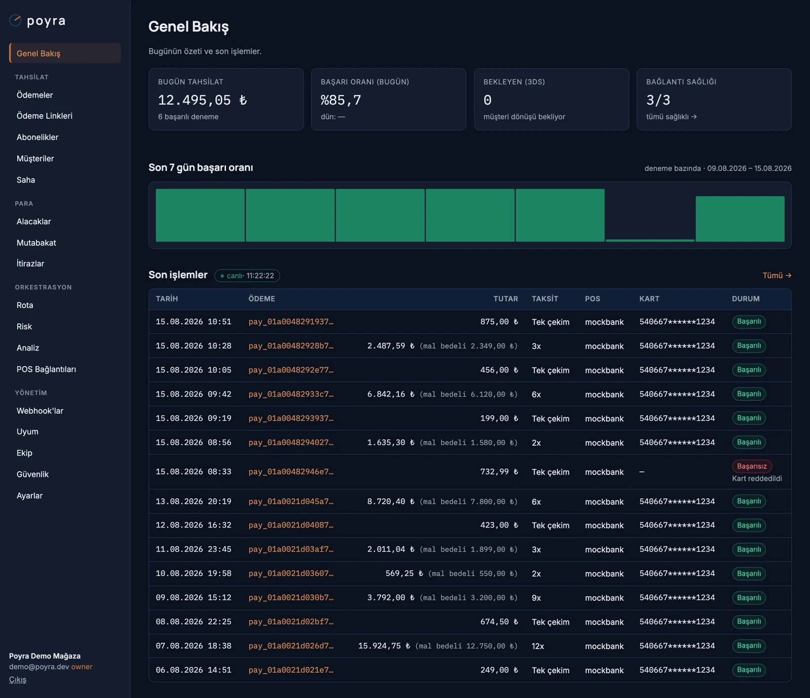

### Bankalardan alacak — orkestrasyonun bittiği yer

README'nin tezi bu ekranda: her tahsilat bankadan **alacağa** çevrilir, POS ekstresi ve banka
hesap ekstresiyle **üç yönlü** karşılaştırılır. `beklenen` ile `kesilen` komisyon ayrı sütunlarda
durur, valör gecikmesi gün olarak işaretlenir, eksik yatan para **"bankadan sorulacak"** diye
açık kalır — kapatılmaz.

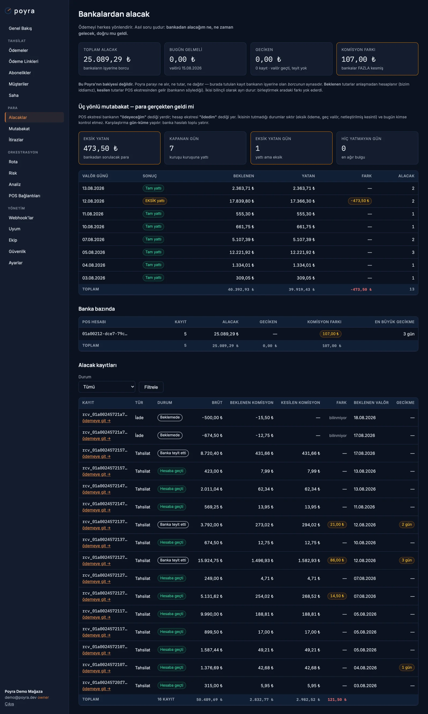

### Komisyon denetimi — "Bankaya İtiraz Raporu"

Gün sonu ekstresi anlaşmayla kuruşu kuruşuna karşılaştırılır. Fazla kesim işlem bazında
listelenir, valör gecikmesi uyarıya döner; fiş Logo/Mikro biçiminde dışa aktarılır.

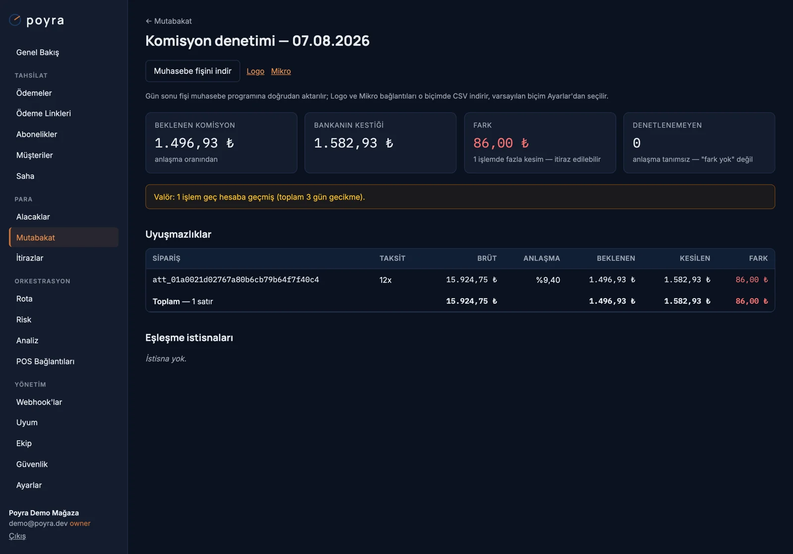

### Rota tasarımcısı — açıklanabilir yönlendirme

Kural DSL'i hem JSON hem **görsel kurucu** olarak düzenlenir; yayına almadan önce
geçmiş işlemler üzerinde simüle edilir. Sürümlüdür, tek tıkla geri alınır.

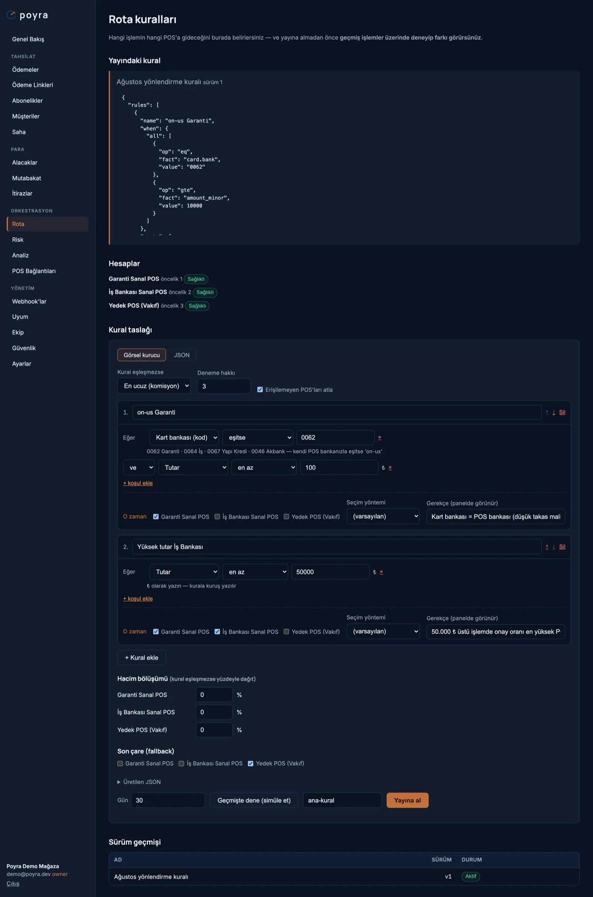

Kararın gerekçesi işlemin üstünde durur: **"neden bu POS?"**, deneme geçmişi (failover dahil)
ve silinemez olay çizelgesi.

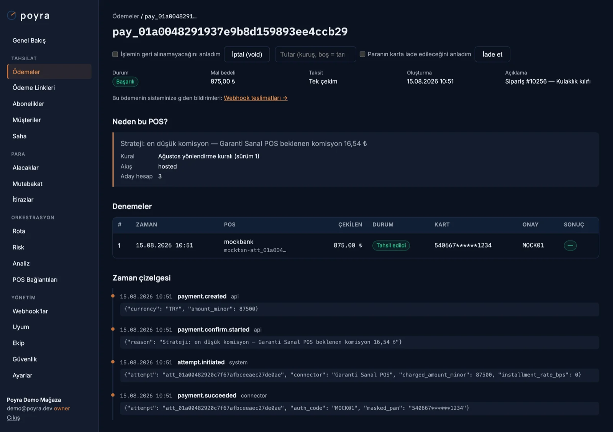

### Checkout — white-label ödeme sayfası

Kimliksiz, işyerinin adı/rengiyle. Taksit seçenekleri kartın **ilk 6 hanesinden** hesaplanır
(PAN değil — PCI kapsamı dışı); vade farkı kuruşuyla gösterilir, kart bilgisi bankanın
sayfasında alınır.

<p align="center">
  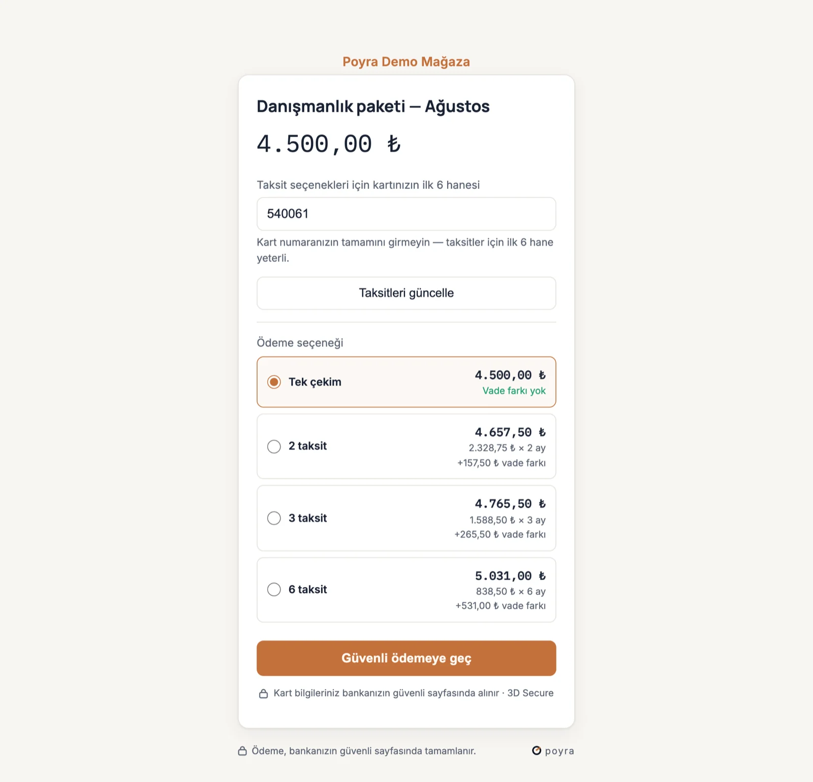
  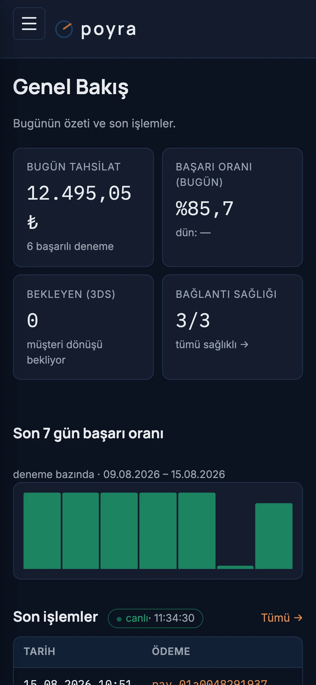
</p>

<details>
<summary><b>Diğer ekranlar</b> — ödemeler · mutabakat · abonelik · itiraz · risk · uyum · saha · 2FA…</summary>

<br />

| Ekran | Görüntü |
|---|---|
| Giriş (TOTP 2FA'lı) | [01-giris](docs/gorseller/01-giris.webp) |
| Ödemeler listesi | [03-odemeler](docs/gorseller/03-odemeler.webp) |
| Mutabakat — ekstre yükleme ve gün sonu listesi | [05-mutabakat](docs/gorseller/05-mutabakat.webp) |
| POS bağlantıları (dinamik kimlik formu + sağlık) | [07-pos-baglantilari](docs/gorseller/07-pos-baglantilari.webp) |
| Abonelikler ve planlar | [08-abonelikler](docs/gorseller/08-abonelikler.webp) |
| Ödeme linkleri (QR + TR Karekod, SMS) | [09-odeme-linkleri](docs/gorseller/09-odeme-linkleri.webp) |
| Harcama itirazları (süre bekçisi) | [10-itirazlar](docs/gorseller/10-itirazlar.webp) |
| Müşteri tek görünümü | [11-musteriler](docs/gorseller/11-musteriler.webp) |
| Webhook'lar (imza sırrı, teslim günlüğü, replay) | [12-webhooklar](docs/gorseller/12-webhooklar.webp) |
| Risk kuralları ve kara liste | [13-risk](docs/gorseller/13-risk.webp) |
| Analiz | [14-analiz](docs/gorseller/14-analiz.webp) |
| Güvenlik — TOTP 2FA kurulumu | [15-guvenlik-2fa](docs/gorseller/15-guvenlik-2fa.webp) |
| Uyum / denetim defteri | [16-uyum](docs/gorseller/16-uyum.webp) |
| Saha Uygulaması — temsilci ve kuyruk | [17-saha](docs/gorseller/17-saha.webp) |
| Ayarlar · Ekip | [18-ayarlar](docs/gorseller/18-ayarlar.webp) · [19-ekip](docs/gorseller/19-ekip.webp) |
| Checkout (mobil) | [24-checkout-mobil](docs/gorseller/24-checkout-mobil.webp) |

</details>


## Özellikler

**Tahsilat**
- Banka-hosted 3DS akışı (kart verisi Poyra'ya hiç uğramaz) ve PCI kapsamındaki kurulumlar için direct/token akışı
- **21 konnektör**, üç ailede *(ayrıntılı yetenek matrisi: [Konnektörler](#konnektörler))*
  - **Banka sanal POS:** NestPay (12 banka) · GVP (Garanti) · PayFlex (VakıfBank) · Posnet (YKB) · InterVPOS (Denizbank) · PayFor (QNB Finansbank) · Kuveyt Türk + Vakıf Katılım (BOA)
  - **Ödeme kuruluşları:** İyzico · Craftgate · PayNKolay · Payten/MSU (3 marka) · CCPayment (7 marka) · Moka · Tami · ParamPos · AHL Pay · PayTR
  - **E-ihracat ve test:** Stripe · Adyen · MockBank
- Ödeme linki (sabit/açık tutar, SMS ile gönderim, QR + TR Karekod), white-label checkout (işyerinin logosu/rengi/alan adı)
- BIN kataloğu + taksit şemaları + vade farklı teklif (quote), kuruş kaybolmaz
- Void (gün sonu öncesi komisyonsuz iptal), kısmi iade, `Idempotency-Key` (API geneli)

**Orkestrasyon**
- Kural DSL'i (all/any, kart sinyalleri: BIN, banka, on-us, program, tip, **ülke**; **kanal:** API · ödeme linki · saha tahsilatı · abonelik yenilemesi) + stratejiler: `cheapest` · `best_success` · `fastest` · `balanced` · `commitment` · `priority`, hacim bölüşümü, fallback
- Initiate aşamasında failover; canary sağlık yoklaması (bozuk POS rotadan otomatik düşer)
- **Hacim taahhüdü:** "bu bankaya ayda X ₺ söz verdim" tanımlanır; `commitment` stratejisi açığı olan hesabı öne alır (aciliyet = kalan tutar ÷ kalan gün), açık kapanınca hesap kendiliğinden öncelik sırasına döner. Taahhüt tutmazsa banka indirimli oranı geri çeker — Poyra bunu ay sonunda değil, gün gün gösterir
- **Ölçüm kotası:** başarı/hız sinyaline dayanan stratejilerde trafiğin %10'u (ayarlanır) ölçümü olmayan POS'a ayrılır — yoksa kazanan POS tüm trafiği alır, ölçülemeyen POS penceresi boşalınca kalıcı olarak sona düşer ve banka toparlansa bile geri dönemez. Kova deterministiktir; kotaya düşen deneme başarısız olursa failover en iyi POS'u yakalar
- Simülatör: aday kuralı geçmiş işlemlerde oynatır, POS değişimini ve komisyon tasarrufunu raporlar
- Sürümlü kurallar + panelden iki aşamalı yayın + tek tık geri dönüş (rollback)

**Para ve muhasebe**
- Para defteri: tahsilat → bankadan alacak (beklenen komisyon + iş günü valörü); `expected*` ile `confirmed*` ayrı durur
- Üç yönlü mutabakat: Poyra defteri ↔ POS ekstresi ↔ banka **hesap ekstresi** (MT940/CSV); tek kuruş fark bile bulgudur
- Komisyon denetimi + "Bankaya İtiraz Raporu"; itiraz talebi kısmi tahsilatlarla kapanışa kadar izlenir
- **On-us oranı:** komisyon anlaşması karta göre daralır (kendi bankanızın kartı daha ucuza geçer). Aynı oran rota maliyetinde, alacak defterinde ve ekstre denetiminde **tek yerden** çözülür — ayrışsalardı denetim, doğru kesim yapan bankayı haksız yere suçlardı
- Valör kaybı: `tutar × (yıllık oran / 365) × gecikme günü` — "3 gün gecikme 280,48 ₺'ye mal oldu"
- Logo/Mikro çift taraflı muhasebe fişi (Tekdüzen Plan, dengesiz fiş üretilmez), TR biçimli CSV dışa aktarım

**Abonelik ve müşteri**
- Planlar, deneme süresi, dönem ilerletme, kart güncelleme; TR'ye özgü **akıllı yeniden tahsilat** (limit yetersiz → maaş penceresi; süresi dolmuş kart → kör deneme yok)
- Müşteri tek görünümü, ödeme talimatı (mandate), KVKK silme (mali kayıt saklama yükümlülüğüyle uyumlu)

**Risk ve uyum**
- Risk motoru: `allow / challenge (3DS zorunlu) / review / block`, kara liste, hız (velocity) sayaçları, yayınsız kural testi
- Harcama itirazları: iş günü takvimli süre bekçisi, kanıt dosyaları, kademe takibi
- Birleşik denetim defteri (reddedilen denemeler dahil), uyum görevlisi ekranı, PCI kanıt paketi

**Platform**
- Çoklu işyeri izolasyonu: EF global filter **+** Postgres RLS (iki katman; biri delinirse öteki tutar)
- Panel: Blazor (koyu tema, mobil çekmece gezinme), canlı pano (LISTEN/NOTIFY), **TOTP 2FA** (QR kurulum, kurtarma kodları, cihaz hatırlama, owner/admin zorunluluk politikası)
- Webhook'lar: transactional outbox → HMAC imzalı teslim → üstel yeniden deneme → replay
- Saha Uygulaması: MAUI/Android + SQLite kuyruk; sunucu zaman otoritesi
- Scalar API dokümantasyonu, Hangfire; **üç host'ta da OpenTelemetry** (iz + ölçüm) —
  dışa aktarıcı yalnız `OTEL_EXPORTER_OTLP_ENDPOINT` tanımlıysa devreye girer, yani
  koleksiyoncu kurmayan kurulum hiçbir şey kaybetmez

## Konnektörler

Poyra bankalarla **protokol** üzerinden konuşur: NestPay bir bankanın değil, onlarca
bankanın kullandığı altyapının adıdır. Aynı desen ödeme kuruluşlarında da geçerlidir —
CCPayment tek konnektördür ama arkasında yedi marka vardır; sağlayıcı seçimi hesabın
`gateway_base` alanıyla yapılır. Yedi marka için yedi adaptör yazmak, aynı hatayı yedi
yerde düzeltmek olurdu.

Tablodaki **hosted / 3DS'li direct** ayrımı yalnız bir teknik ayrıntı değil, PCI
kapsamınızı belirler: hosted akışta kart bankanın sayfasında girilir ve Poyra'ya hiç
uğramaz; 3DS'li direct'te kart işyeri formunda toplanır (doğrulama yine bankada olur).
Yalnız 3DS'li direct sunan hesaplar hosted rotada aday listesinden **otomatik düşer**.

<details open>
<summary><b>Banka sanal POS'ları</b></summary>

| Anahtar | Banka / kapsam | Hosted | 3DS direct | Taksit | İptal | İade |
|---|---|:-:|:-:|:-:|:-:|:-:|
| `nestpay` | NestPay/EST — İş, Ziraat, Halk, TEB, ING, Şeker, Akbank, Anadolu, Alternatif, Türkiye Finans, QNB, Cardplus | ✅ | — | ✅ | ✅ | ✅ |
| `gvp` | Garanti BBVA (3D_PAY) | ✅ | — | ✅ | ✅ | ✅ |
| `payflex` | VakıfBank (Ortak Ödeme Sayfası) | ✅ | — | ✅ | ✅ | ✅ |
| `posnet` | Yapı Kredi (OOS) | — | ✅ | ✅ | ✅ | ✅ |
| `intervpos` | Denizbank InterVPOS (3D Pay) | ✅ | — | ✅ | ✅ | ✅ |
| `kuveytturk` | Kuveyt Türk (BOA/PayGate) | ✅ | — | ✅ | ✅ | ✅ |
| `vakifkatilim` | Vakıf Katılım (BOA/PayGate) | ✅ | — | ✅ | ✅ | ✅ |
| `payfor` | QNB Finansbank PayFor (3DPay) | ✅ | — | ✅ | ✅ | ✅ |

</details>

<details open>
<summary><b>Ödeme kuruluşları (yurt içi)</b></summary>

| Anahtar | Sağlayıcı / kapsam | Hosted | 3DS direct | Taksit | İptal | İade |
|---|---|:-:|:-:|:-:|:-:|:-:|
| `iyzico` | İyzico (IYZWSv2) | — | ✅ | ✅ | ✅ | ✅ |
| `craftgate` | Craftgate — ortak sayfa **ve** 3DS'li direct | ✅ | ✅ | ✅ | ✅ | ✅ |
| `paynkolay` | PayNKolay | ✅ | — | ✅ | ✅ | ✅ |
| `payten` | Payten/MSU — Paratika, VakıfPayS, ZiraatPay | — | ✅ | ✅ | ✅ | ✅ |
| `ccpayment` | Sipay, QNBPay, Vepara, PayBull, Parolapara, IQmoney, HalkÖde | — | ✅ | ✅ | ✅ | ✅ |
| `moka` | Moka | — | ✅ | ✅ | ✅ | ✅ |
| `tami` | Tami | — | ✅ | ✅ | ✅ | ✅ |
| `parampos` | ParamPos (TurkPos) — SOAP/XML | — | ✅ | ✅ | ✅ | ✅ |
| `ahlpay` | AHL Pay | — | ✅ | ✅ | ✅ | ✅ |
| `paytr` | PayTR | — | ✅ | ✅ | — | ✅ |

</details>

<details open>
<summary><b>E-ihracat ve test</b></summary>

| Anahtar | Sağlayıcı / kapsam | Hosted | 3DS direct | Taksit | İptal | İade |
|---|---|:-:|:-:|:-:|:-:|:-:|
| `stripe` | Stripe Checkout — yurt dışı satış | ✅ | — | — | ✅ | ✅ |
| `adyen` | Adyen Pay by Link — yurt dışı satış | ✅ | — | — | ✅ | ✅ |
| `mockbank` | Test bankası (sihirli tutarlar) | ✅ | ✅ | ✅ | ✅ | ✅ |

</details>

Tablodaki boşluklar bilinçlidir:

- **Posnet, İyzico, Payten, CCPayment, Moka, Tami, ParamPos, AHL Pay ve PayTR** banka-hosted
  kart girişi *sunmaz*. Adaptör "desteklemiyor" der; uydurma bir akışa düşülmez.
- **PayTR'da ayrı iptal ucu yoktur** — void `poyra.not_supported` döner, gün içi işlem de
  iade ucundan geçer. **Craftgate**'te tersi: ayrı iptal ucu yok ama iade ucu gün içi
  işlemde CANCEL üretir.
- **Stripe ve Adyen** Türk banka taksidini bilmez; taksitli işlem bu hesaplara hiç
  yönlendirilmez — aksi hâlde tutar tek çekim alınır ve vade farkı sessizce kaybolurdu.

> [!WARNING]
> **Sertifikasyon bekleyenler:** `intervpos` · `kuveytturk` · `vakifkatilim` · `payfor` ·
> `iyzico` · `moka` · `payten` · `ccpayment` · `paynkolay` · `tami` · `ahlpay` ·
> `parampos` · `paytr` · `craftgate`. Bu adaptörlerin akışı, tutar biçimi, hash yapısı ve
> hata eşlemesi kurulu ve testlidir; ama alan adları, imza sırası ve durum kodları
> sağlayıcının kendi dokümanıyla doğrulanmadan üretim trafiği açılmamalıdır. Katalogda
> görünen adlarının sonunda **"SERTİFİKASYON BEKLİYOR"** yazar, koddaki karşılıkları
> `TODO(cert)` işaretleridir (`grep -rn "TODO(cert)" src/Connectors`). `gvp`, `payflex`,
> `posnet` ve `nestpay` de sandbox doğrulaması bekleyen maddeler taşır; `stripe`/`adyen`
> sertifikasyon gerektirmez.

Katalog `GET /v1/connectors/catalog`, "benim kurulumum bugün ne yapabilir" ise
`GET /v1/platform/capabilities` ile okunur. Katalog kimlik alanlarını da taşır — paneldeki
POS ekleme formu bu şemadan üretilir, yeni konnektör için elle form yazılmaz.

**Konnektör uyum kiti.** Ortak sözleşmeyi tek tek konnektör testleri değil, listesini
DI kaydından okuyan bir uyum kiti zorlar: yeni banka eklendiğinde teorilerin verisi
kendiliğinden büyür. Kit ilk koşuşunda 46 vakadan 8'ini kırdı — en ciddisi güvenlikti:
InterVPOS'ta imza denetimi "hash var ama tutmuyorsa reddet" biçimindeydi (alan hiç
gönderilmezse doğrulama atlanıyordu), Kuveyt Türk'te ise hiç imza doğrulaması yoktu.
Callback adresi tek kullanımlık 256 bit belirteç taşıdığı için rastgele biri erişemiyordu,
ama **ödemeyi yapan müşteri o adresi kendi tarayıcısında görüyordu**. Artık imzanın
*yokluğu* da reddedilir; BOA ailesinde tarayıcı dönüşü tek başına asla başarı sayılmaz.

## Mimari

### Dört ilke

| # | İlke | Anlamı |
|---|------|--------|
| 1 | **Modüler monolit** | Türkiye'nin tüm kartlı e-ticaret hacmi tek Postgres'e sığar. Modüller yalnız `*.Contracts` üzerinden konuşur; sınır **mimari testle** (NetArchTest) zorlanır. Mikroservisin çözdüğü hiçbir problem bu ölçekte yok. |
| 2 | **Offline-first istemci, sunucu otoritesi** | Saha cihazı ağsızken kayıt kuyruklar; ama **yasal işlem zamanı yalnız sunucu saatinden** yazılır. Cihaz "tahsil edildi" üretemez — yalnız "tahsilat talebi" üretir. |
| 3 | **Hiçbir operasyonel kayıt silinmez** | Olay defterlerinde `DELETE` (çoğunda `UPDATE` de) hakkı uygulama rolünde **yoktur** — GRANT düzeyinde. İptal = yeni durum + yeni olay. KVKK silme bir UPDATE'tir; mali kayıt yerinde kalır. |
| 4 | **İki katmanlı işyeri izolasyonu** | Katman A: EF global query filter. Katman B: Postgres **RLS** (`poyra_app` rolü NOBYPASSRLS, açılışta canlı doğrulanır). RLS testleri ham SQL ile bile işyerleri arası görünmezliği kanıtlar. |

### Çözüm yapısı

```
poyra/
├─ src/
│  ├─ Poyra.SharedKernel        Elle yazılmış CQRS dispatcher, TenantContext/UserContext,
│  │                            IClock, TurkishText, para/giriş yardımcıları, sır şifreleme
│  ├─ Poyra.Persistence         ModuleDbContext tabanı, RLS + audit interceptor'ları, snake_case
│  ├─ Connectors/               Abstractions + 21 banka/PSP adaptörü — NestPay · GVP ·
│  │                            PayFlex · Posnet · InterVPOS · PayFor · BOA (KuveytTürk +
│  │                            VakıfKatılım) · İyzico · Craftgate · PayNKolay · Payten ·
│  │                            CCPayment · Moka · Tami · ParamPos · AhlPay · PayTR ·
│  │                            Stripe · Adyen · MockBank
│  ├─ Modules/                  20 iş modülü — her biri kendi DbContext + migration geçmişiyle:
│  │                            Tenancy · Connectors · Routing · Payments · Installments · Vault ·
│  │                            Webhooks · Recon · Ledger · Subscriptions · PaymentLinks ·
│  │                            Disputes · Risk · Compliance · Customers · Field
│  ├─ Poyra.Api                 REST API (FastEndpoints), banka callback'leri, Hangfire, Scalar, OTel
│  ├─ Poyra.Panel               İşyeri paneli (Blazor, statik SSR + interaktif adalar)
│  ├─ Poyra.Checkout            Müşteriye bakan kimliksiz ödeme sayfası (açık tema)
│  ├─ Poyra.Field.Core          Saha kuyruk/senkron mantığı (sade, testli kütüphane)
│  ├─ Poyra.Field.App           MAUI/Android saha uygulaması (ince kabuk)
│  └─ Poyra.AppHost             .NET Aspire — geliştirmede her şeyi tek komutla ayağa
│                               kaldıran orkestrasyon (üretimde kullanılmaz)
├─ tests/                       Unit · Architecture (modül sınırı + PCI bekçileri) · Integration
├─ docker/ + docker-compose*.yml
└─ docs/gorseller/              README ekran görüntüleri (ürün dokümanları ayrı sitede:
                                poyra-docs.dakicksoft.com)
```

### Bileşenler

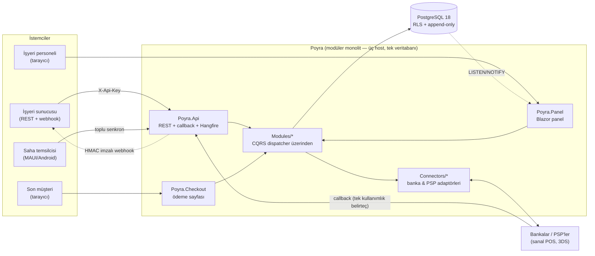

- **Panel neden API'ye HTTP atmaz?** Modüler monolit avantajı: Panel aynı süreçte aynı
  komut/sorgu yolunu (dispatcher) doğrudan çağırır — çift serileştirme ve ek gecikme yok.
- **Checkout neden ayrı host?** Kimliksiz, herkese açık ve saldırı yüzeyi en geniş bileşen;
  panelden ve API'den ayrı ölçeklenir/kapatılır. İşyeri slug'dan çözülür, sonrası normal RLS'li akış.
- **Kart verisi nerede?** Hosted akışta hiç uğramaz (banka sayfası). Direct/token akışı için Kasa
  modülü: PAN AES-256-GCM zarfta, **CVV asla saklanmaz** — ayrıntı:
  [mimari dokümanı](https://poyra-docs.dakicksoft.com/tr/baslangic/mimari), bekçi testleri:
  [sürüm kalitesi](https://poyra-docs.dakicksoft.com/tr/kurulum/surum-kalitesi).

## Akışlar

### 1 · Banka-hosted 3DS ödeme akışı

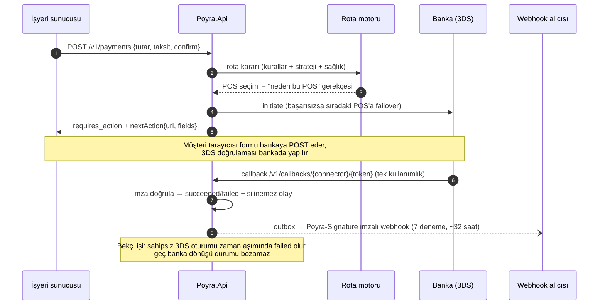

### 2 · Ödeme muhasebesi: alacaktan mutabakata

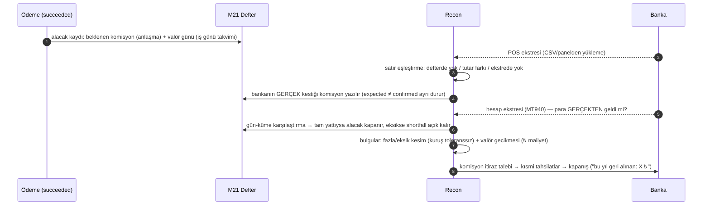

### 3 · Saha Uygulaması çevrimdışı tahsilat

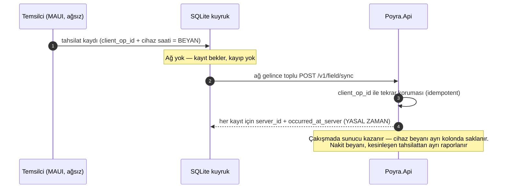

## Hızlı başlangıç (geliştirme ortamı)

**Gereksinimler:** [.NET 10 SDK](https://dotnet.microsoft.com/download) · Docker

**Tek komut** — .NET Aspire veritabanını, üç host'u ve aralarındaki bağlantıları birlikte ayağa kaldırır:

```bash
git clone https://github.com/Dakicksoft/poyra.git && cd poyra
dotnet run --project src/Poyra.AppHost
```

Açılan Aspire panosunda beş kaynak da **Running** olur; günlükler, izler ve sağlık
durumu tek ekrandadır:

| Kaynak | Adres |
|---|---|
| **Aspire panosu** | http://localhost:15080 (konsolda tek kullanımlık giriş bağlantısı yazar) |
| API | http://localhost:5080 — Scalar dokümantasyonu: [/docs](http://localhost:5080/docs) · sağlık: `/health/live`, `/health/ready` |
| Panel | http://localhost:5090 |
| Checkout | http://localhost:5095/l/{slug} |
| Postgres 18 | localhost:5442 (`poyra` sahip rolü + `poyra_app` uygulama rolü) |

AppHost'un sizin yerinize kurduğu sıra: Postgres ayağa kalkar → `docker/initdb`
betikleri **poyra_app** rolünü açar → API şemayı uygular (`Database:AutoMigrate`) →
Panel ve Checkout ancak API sağlıklı olunca başlar. Bağlantı dizeleri ve üç host'un
birbirine verdiği adresler koddan üretilir; elle yazılan localhost portu kalmaz —
[src/Poyra.AppHost/Program.cs](src/Poyra.AppHost/Program.cs).

Üç uygulamanın da izleri ve ölçümleri panoya akar: bir ödeme isteğinin hangi adımda
takıldığını, hangi SQL'in yavaş olduğunu ayrı bir araç kurmadan görürsünüz. Telemetri
uygulamaların kendi OpenTelemetry kurulumundan gelir — Aspire'a bağımlı değildir,
üretimde de kendi koleksiyoncunuza aynı şekilde akar.

<details>
<summary><b>Aspire'sız kurulum</b> — docker compose + üç terminal (eski yol, hâlâ çalışır)</summary>

<br />

```bash
docker compose up -d                      # Postgres 18 (localhost:5442) + poyra_app rolü
dotnet run --project src/Poyra.Api        # Development: migration'ları açılışta kendisi uygular
```

Ayrı terminallerde:

```bash
dotnet run --project src/Poyra.Panel      # işyeri paneli
```

```bash
dotnet run --project src/Poyra.Checkout   # müşteriye bakan ödeme sayfası
```

İkisi **aynı anda** çalıştırılmaz: hem compose hem Aspire 5442 portunu ister. Aspire
kendi veri hacmini (`poyra-aspire-pgdata`) kullanır — compose'daki veriniz ayrı durur.

</details>

### İlk işyeri ve ilk ödeme

```bash
# 1) İşyeri aç (geliştirme platform anahtarı: dev-platform-key)
curl -X POST http://localhost:5080/v1/tenants \
  -H "Content-Type: application/json" -H "X-Platform-Key: dev-platform-key" \
  -d '{"name":"Deneme İşyeri","slug":"deneme","ownerEmail":"sahip@ornek.com","ownerPassword":"en-az-10-karakter","ownerName":"Sahip"}'
# → yanıttaki apiKey YALNIZ BİR KEZ gösterilir

# 2) Sanal POS bağla (geliştirmede mockbank; katalog: GET /v1/connectors/catalog)
curl -X POST http://localhost:5080/v1/connector-accounts \
  -H "Content-Type: application/json" -H "X-Api-Key: sk_test_..." \
  -d '{"connectorKey":"mockbank","label":"Mock POS","credentials":{"secret":"s3cret"},"priority":1}'

# 3) Ödeme aç + onayla → rota kararı + bankaya gidecek 3DS formu döner
curl -X POST http://localhost:5080/v1/payments \
  -H "Content-Type: application/json" -H "X-Api-Key: sk_test_..." \
  -d '{"amountMinor":149900,"currency":"TRY","confirm":true}'
# Taksitli denemek için önce taksit şeması tanımlayın (POST /v1/installments/schemes);
# şemasız taksit isteği `installments.not_offered` ile reddedilir — uydurma vade farkı üretilmez.
```

Panele `sahip@ornek.com` ile girin. **Güvenlik** sayfasından TOTP 2FA'yı
(QR + kurtarma kodları) birkaç dakikada kurabilirsiniz.

**MockBank sihirli tutarları:** kuruş `%100 == 99` → kart reddi (05) · `%100 == 98` → 3DS
başarısız · diğerleri onay. Failover senaryosu için kimliklere `fail_initiate=true` ekleyin.

<details>
<summary><b>API turu: webhook · taksit · mutabakat · Kasa · abonelik (örnek curl'ler)</b></summary>

```bash
# Webhook alıcısı — imza sırrı (whsec_…) yalnız bu yanıtta görünür
curl -X POST http://localhost:5080/v1/webhook-endpoints \
  -H "Content-Type: application/json" -H "X-Api-Key: sk_test_..." \
  -d '{"url":"https://siteniz.com/poyra-hook","eventTypes":["payment.succeeded","refund.succeeded"]}'
# Teslimler: Poyra-Signature: t={unix},v1=HMACSHA256(secret, "{t}.{gövde}")
# Günlük + replay: GET /v1/webhook-deliveries · POST /v1/webhook-deliveries/{id}/replay

# Taksit teklifi — kartın İLK 6-8 HANESİ ile (PAN değil, PCI kapsamı dışı)
curl -X POST http://localhost:5080/v1/installments/quote \
  -H "Content-Type: application/json" -H "X-Api-Key: sk_test_..." \
  -d '{"bin":"540061","amountMinor":149900}'

# Komisyon anlaşması + ekstre → mutabakat ve komisyon denetimi (finance+ rolü)
curl -X POST http://localhost:5080/v1/recon/agreements \
  -H "Content-Type: application/json" -H "X-Api-Key: sk_test_..." \
  -d '{"connectorAccountId":"...","installmentCount":1,"rateBps":200,"valorDays":1}'
curl -X POST "http://localhost:5080/v1/recon/statements/upload" \
  -H "X-Api-Key: sk_test_..." \
  -F "file=@ekstre.csv" -F "connectorAccountId=..." -F "statementDate=2026-08-01" -F "format=poyra_csv"
#   GET /v1/recon/statements/{id}/commission-report  ← "Bankaya İtiraz Raporu"
#   GET /v1/recon/statements/{id}/valor-report       ← geç hesaba geçiş denetimi
# (Aynı yükleme panelin Mutabakat ekranından da yapılır: format poyra_csv | nestpay_csv | gvp_csv)

# Kasa + direct akış (PCI kapsamı — sertifikasyon öncesi yalnız test/sandbox!)
curl -X POST http://localhost:5080/v1/vault/cards \
  -H "Content-Type: application/json" -H "X-Api-Key: sk_test_..." \
  -d '{"cardNumber":"4111111111111111","expiryMonth":12,"expiryYear":2031,"customerRef":"musteri-1"}'
# → tok_… (PAN yanıtta YOK, CVV hiç saklanmaz)

# Abonelik: plan → kayıtlı kartla tekrarlayan tahsilat → yeniden tahsilat izleme
curl -X POST http://localhost:5080/v1/plans \
  -H "Content-Type: application/json" -H "X-Api-Key: sk_test_..." \
  -d '{"name":"Aylık Paket","amountMinor":15000,"interval":"month","trialDays":14}'
curl -X POST http://localhost:5080/v1/subscriptions \
  -H "Content-Type: application/json" -H "X-Api-Key: sk_test_..." \
  -d '{"planId":"pln_...","customerRef":"musteri-1","cardToken":"tok_..."}'
# GET /v1/subscription-invoices?subscriptionId=sub_...  (paid|retrying|abandoned, nextRetryAt)
```

Rota kuralı örneği (DSL şeması: [RuleDocument.cs](src/Modules/Poyra.Modules.Routing/Dsl/RuleDocument.cs)):

```json
{
  "strategy": "cheapest",
  "rules": [
    { "name": "on-us", "reason": "Kart bankası = POS bankası (düşük takas)",
      "when": { "all": [ { "fact": "card.bank", "op": "eq", "value": "0062" },
                         { "fact": "amount_minor", "op": "gte", "value": 10000 } ] },
      "route": ["Garanti POS"] }
  ],
  "fallback": ["Yedek POS"],
  "guards": { "skipUnhealthy": true, "maxAttempts": 3 }
}
```

</details>

## Üretim kurulumu (self-host)

Poyra tek Postgres ve üç web süreciyle çalışır; kurulum yarım saatlik iştir.
Adım adım rehber: **[poyra-docs.dakicksoft.com → Kurulum](https://poyra-docs.dakicksoft.com/tr/kurulum/docker)**. Özet:

```bash
cp .env.example .env
./scripts/anahtar-uret.sh >> .env     # 3 ayrı AES-256 anahtarı + platform sırları üretir
docker compose -f docker-compose.prod.yml up -d
```

- **Üç ayrı anahtar** üretilir (banka kimlikleri / kart kasası / JWT) — biri sızarsa diğerleri açılmaz.
- Migration'lar **ayrı bir işle, sahip rolüyle** koşar; uygulama yalnız `poyra_app`
  (NOBYPASSRLS) ile bağlanır ve açılışta bunu **canlı doğrular** — süper kullanıcıyla üretimde açılmaz.
- Açılışta sır doğrulaması: zayıf/eksik anahtar varsa uygulama **hiç açılmaz**.
- TLS bilinçli olarak kompozisyon dışındadır: üç host 127.0.0.1:8080'de dinler; önüne
  Caddy/nginx/Traefik koyup üç alan adına sertifika bağlarsınız.
- Kurumsal kurulumda `.env` yerine Docker secrets / Vault / KMS kullanın — PCI bunu ister.

## Geliştirme rehberi

### Testler

```bash
./scripts/test-hizli.sh    # birim + mimari — Docker gerekmez, saniyeler
./scripts/test-kapsam.sh   # tüm katmanlar + kapsam raporu (Docker gerekir)
dotnet test                # hepsi, kapsam olmadan
```

1.197 test, dört katman — hangi katmanın neyi kanıtladığı:

- **788 birim** — konnektör hash'leri, TOTP RFC 6238 vektörleri, taksit matematiği,
  EMV QR, yeniden tahsilat politikası ve **konnektör uyum kiti** (her `IPaymentConnector`
  uygulamasının tutmak zorunda olduğu ortak sözleşme; konnektör listesi DI kaydından
  okunur, yeni banka eklendiğinde kendiliğinden kapsanır).
- **37 mimari/PCI bekçisi** — modül sınırı, CVV sütunu yokluğu, düz PAN taraması.
- **350 entegrasyon** — gerçek PG 18 + gerçek HTTP webhook alıcısı + panel/checkout
  HTML doğrulaması + LISTEN/NOTIFY + arka plan işlerinin işyeri döngüsü.
- **22 E2E** — gerçek tarayıcı (Playwright): interaktif adalar (canlı akış, rota
  tasarımcısı), TOTP 2FA yolculuğu, tehlikeli aksiyon onayı, tek kullanımlık sır,
  375px mobil çekmece, yazdırma stilleri. Uygulamalar test sürecinde gerçek Kestrel
  portlarında ayağa kalkar — dışarıda ayakta duran servise bağımlılık yok.

### Yük profili

Testlerin dördüncü katmanı doğruluğu kanıtlar; ölçek iddiası ayrı bir araca bırakıldı.
`tests/Poyra.Tests.Load` bir **konsol uygulamasıdır** — `dotnet test` onu görmez, CI'ın
normal akışına karışmaz, elle ya da [ayrı workflow](.github/workflows/yuk-profili.yml)
ile koşar:

```bash
dotnet run --project tests/Poyra.Tests.Load -c Release -- --sure 30 --es 16
```

Hazır bir yük aracı yerine ~250 satır elle yazıldı: NBomber v6 kurumsal kullanımda ücretli
aboneliğe bağlı ve paketi buraya eklemek, **Poyra'yı self-host eden her kuruma** aynı
yükümlülüğü bindirirdi. k6 lisans açısından uygun ama yalnız HTTP konuşur — rota karar
çekirdeğinin süreç içi ölçümü onunla yazılamazdı.

Bir geliştirici dizüstünde (Docker'da ayarsız PG 18, MockBank, yük üreteci uygulamayla
aynı süreçte), 10 sn · 16 eşzamanlı:

| Senaryo | RPS | p50 | p99 | hata |
|---|--:|--:|--:|--:|
| `rota-karari` — karar çekirdeği, I/O yok | **318.000** | 2 µs | 4 µs | %0 |
| `odeme-olustur` — yazma yolu (RLS + olay defteri) | **2.400** | 12 ms | 25 ms | %0 |
| `odeme-confirm` — tam akış (rota + POS + deneme) | **272** | 48 ms | 218 ms | %0 |

Okunuşu: **rota kararı darboğaz değil** — mikrosaniyelik bir iştir, ödeme başına bir kez
koşar ve toplam maliyette görünmez. Tam akış bu donanımda ~16 eşzamanlıda doyuma ulaşır
(günde ~23 milyon işlem); ötesinde gecikme büyür ama verim artmaz. Araç bunu kendisi
raporlar — rakamların yanına ölçüm koşullarını da basar, çünkü koşulsuz bir yük rakamı
pazarlama cümlesidir, mühendislik verisi değil.

Kapsam: satır **%80,7** · dal **%54,3** · metot **%90**. CI iki aşamalıdır — önce
Docker'sız hızlı katman (~1 dk), o yeşilse tam süit + kapsam kapısı. Kapı bir hedef değil
**gerileme** kapısıdır: eşikler ölçülen değerin hemen altına kurulur, testsiz kod eklenince
oran düşer ve PR kırılır. Oran yükseldikçe eşik de yükseltilmelidir.

```bash
./scripts/mutasyon.sh Poyra.Modules.Installments   # mutasyon testi (Stryker.NET)
```

Kapsam "kod çalıştı mı" der, **mutasyon "davranış doğrulandı mı"** der: koda kasıtlı
küçük hatalar enjekte edilir ve testlerin bunları yakalayıp yakalamadığına bakılır.
İlk ölçüm çarpıcı — `Installments` modülünün satır kapsamı %95,6 ama **mutasyon skoru
%76,99**: 35 kasıtlı hata hiçbir testi kırmadan geçti. Pahalıdır (proje başına dakikalar),
bu yüzden her PR'da değil CI'da elle (`workflow_dispatch`) tetiklenir.

Entegrasyon testleri üretimle aynı rol modelini kurar: migration'lar sahip rolle koşar,
testler **poyra_app** rolüyle bağlanır — RLS gerçekten sınanır: işyerleri arası görünmezlik
ham SQL ile doğrulanır, çapraz işyeri insert `42501` ile düşer, olay defterinde
`UPDATE/DELETE` reddedilir.

### Migration

```bash
dotnet dotnet-ef migrations add <Ad> -p src/Modules/Poyra.Modules.Payments -o Migrations
dotnet dotnet-ef database update -p src/Modules/Poyra.Modules.Tenancy    # önce Tenancy!
dotnet dotnet-ef database update -p src/Modules/Poyra.Modules.Payments
```

Her modülün **kendi migration geçmişi** vardır. Sıra önemli: Payments'ın RLS migration'ı
`tenants` tablosuna çapraz modül FK kurar. Geliştirmede API açılışta migration'ları kendisi
uygular (`Database:AutoMigrate`).

### Yeni banka konnektörü eklemek

1. `src/Connectors/Poyra.Connectors.<Banka>/` projesi açın; `IPaymentConnector`'ı uygulayın
   (initiate / callback doğrulama / void / iade — bankanın desteklediği kadarını **beyan edin**,
   yetenek matrisi rota kararında zorlanır).
2. Kataloğa ekleyin (`Modules/Poyra.Modules.Connectors` — kimlik şeması panelde dinamik form
   olur). **DI'a kaydetmek yetmez, `ConnectorRegistry` anahtar listesine de girin:** kayıtlı
   ama listede olmayan konnektör panelin "POS bağlantısı ekle" ekranında hiç görünmez.
3. Hash/imza mantığını **birim testle** kanıtlayın (mevcut `NestPayHashTests`, `GvpHashTests`
   desenleri); akışı MockBank benzeri sahte uçla entegrasyon testinden geçirin. Ortak sözleşme
   için ayrıca test yazmanız gerekmez — `KonnektorUyumTests` listeyi DI kaydından okur ve yeni
   konnektörü **kendiliğinden** kapsar (boş/kurcalanmış callback reddi, forma sır sızmaması,
   erişilemezlikte failover'a uygun hata, kimlik alanı eksikse yapılandırma hatası).
4. Mümkünse `ProbeAsync` uygulayın — canary sağlık yoklaması ve panel "Test et" butonu bundan beslenir.
5. Bankanın gün sonu ekstre formatı varsa `IStatementParser` ile ekleyin — mutabakat panelden çalışır.
6. Banka dokümanı olmadan yazılan adaptörler katalogda **"SERTİFİKASYON BEKLİYOR"** işaretlenir;
   uç adları/hash sırası `TODO(cert)` yorumlarıyla bulunur.

### Kod kuralları

- **Dil Türkçe'dir:** arayüz metinleri, kod yorumları, commit mesajları, dokümanlar.
  Yorumlar "ne"yi değil **"neden"**i anlatır.
- **Para daima kuruştur** (`long amountMinor`); kuruş arayüzde asla gizlenmez. Bölüşümlerde
  bankacı yuvarlaması — kuruş kaybolmaz.
- **Zaman:** veritabanında UTC; "gün" hesapları **TR günüdür** (UTC+3). Gelen her
  `DateTimeOffset` UTC'ye indirgenir. Cihaz saati beyandır, yasal zaman sunucudan (İlke 2).
- **Modül sınırı:** modüller birbirine yalnız `*.Contracts` ile bağlanır — NetArchTest bekçisi
  ihlalde testi kırar. `TenantId` taşıyan her varlık `ITenantOwned` olmalıdır (izolasyon bekçisi).
- **Silinmez kayıt** (İlke 3): operasyonel defterlere `DELETE` yazmayın; iptal/düzeltme = yeni kayıt.
- Türkçe metin işlerken `ToLowerInvariant` değil `TurkishText` yardımcıları ('İ' sorunu — bekçi testi var).

### Saha uygulaması (MAUI)

```bash
# JDK 21 gerekir; çözüm dosyasında DEĞİL, ayrı derlenir.
# Release şart: Debug paketi Fast Deployment kullanır, adb install ile açılmaz.
dotnet build src/Poyra.Field.App -f net10.0-android -c Release
```

Kuyruk/senkron mantığı `Poyra.Field.Core`'dadır (testli); MAUI ince kabuktur.

## Güvenlik

- Panel girişinde **TOTP 2FA** (RFC 6238; QR kurulum, tek kullanımlık kurtarma kodları,
  30 gün cihaz hatırlama, owner/admin için işyeri düzeyi zorunluluk).
- Sırlar: banka kimlikleri ve kart zarfı **AES-256-GCM** (ayrı anahtarlar); API anahtarı ve
  belirteçlerin yalnız **SHA-512 özeti** saklanır; sırlar URL'de asla taşınmaz (tek kullanımlık
  gösterim). CVV hiç saklanmaz.
- Panel formlarında CSRF (antiforgery) koruması; flash mesajları imzalıdır (oltalama linki üretilemez).
- İki katmanlı işyeri izolasyonu (EF filter + RLS) ve append-only defterler — tümü testle kanıtlı.

**Güvenlik açığı bildirimi:** lütfen kamuya açık issue **açmayın** — GitHub'ın
[Security Advisories](https://github.com/Dakicksoft/poyra/security/advisories/new)
özelliğiyle özel bildirim yapın. Düzeltme yayınlanana kadar ayrıntıyı paylaşmamanızı rica ederiz.
Kapsam, süreç ve test kuralları: [SECURITY.md](SECURITY.md)

## Yol haritası

- **TCMB azami komisyon karşılaştırması** — komisyon denetimine "anlaşman azami oranın üstünde" uyarısı (aylık ilan, tarih aralıklı veri tablosu)
- **Sanal POS "hava durumu"** — sentetik canary işlemlerle kamuya açık banka bazlı kesinti sayfası
- **Chargeback delil paketi** — 3DS kanıtı + silinemez kütük + teslimat referansını tek PDF'te derleyen üretici
- **SMMM (mali müşavir) portalı** — tek girişle çok işyeri mutabakatı, salt-okuma danışman rolü
- **Self-servis kayıt + şeffaf fiyat sayfası** — sandbox anında, üretime 48 saatte
- **Havale/FAST ile ödeme seçeneği** — checkout'ta; MT940 eşleştirme altyapısı hazır
- **Anonim onay oranı kıyas ağı** (KVKK uyumlu) · **saklı kart transfer aracı** · **yemek kartı ağları** · **Helm paketi**


## Sürüm ve dal modeli

Poyra **GitFlow** kullanır. Sürüm numarasının tek kaynağı
[Directory.Build.props](Directory.Build.props) içindeki `<Version>`; aynı numara etikete,
GitHub sürümüne, konteyner imajına ve API'nin `/health` yanıtına birlikte gider.

| Dal | Rolü |
|---|---|
| `develop` | Geliştirmenin buluştuğu dal — `feature/*` buradan dallanır, buraya döner |
| `release/x.y.z` | Sürüm hazırlığı; develop'tan açılır, sürüm numarası burada yükselir |
| `main` | Üretimdeki kod; yalnız `release/*` ve `hotfix/*` birleşir, her birleşme bir sürümdür |
| `hotfix/x.y.z` | Üretimdeki acil düzeltme; main'den açılır |

Akış tek elle tetiklenir, gerisi otomatiktir:

```
Actions → "Sürüm hazırla" (sürüm no gir)
   → release/x.y.z dalı açılır, sürüm yükseltilir, main'e PR açılır
   → PR birleşince "Sürüm yayınla" devralır:
        v.x.y.z etiketi · GitHub sürümü (değişiklik listesiyle)
        · üç konteyner imajı GHCR'a (amd64 + arm64) · main → develop geri birleştirme PR'ı
```

**Yayımlanan imajlar** ([GitHub Packages](https://github.com/Dakicksoft/poyra/pkgs/container/poyra-api)):

```bash
docker pull ghcr.io/dakicksoft/poyra-api:latest
docker pull ghcr.io/dakicksoft/poyra-panel:latest
docker pull ghcr.io/dakicksoft/poyra-checkout:latest
```

**CI iki aşamalıdır** ([ci.yml](.github/workflows/ci.yml)): önce Docker'sız hızlı katman
(birim + mimari, ~1 dk), o yeşilse gerçek Postgres ve gerçek tarayıcıyla tam süit +
kapsam kapısı. Mutasyon testi pahalı olduğu için elle tetiklenir
([mutasyon.yml](.github/workflows/mutasyon.yml)).

## Katkı

Katkılar memnuniyetle karşılanır:

1. Büyük değişiklikten önce bir **issue** açıp yaklaşımı konuşalım — modül sınırları ve
   ilkeler (yukarıda) tasarım tartışmasının çerçevesidir.
2. `develop`'tan `feature/...` dalı açın, değişikliği yapın; PR'ı **develop'a** açın
   (`main` yalnız sürüm dallarını kabul eder). **Testsiz davranış değişikliği kabul edilmez**
   (`dotnet test` yeşil olmalı — mimari testler dahil).
3. Commit mesajları Türkçe ve [Conventional Commits](https://www.conventionalcommits.org/) düzenindedir:
   `feat(routing): …` · `fix(panel): …` · `docs: …`
4. PR açıklamasında "neden"i anlatın; arayüz değişikliğinde ekran görüntüsü ekleyin.

Dokümantasyon: **[poyra-docs.dakicksoft.com](https://poyra-docs.dakicksoft.com/)** ·
kısa yol rehberleri: [proje wiki'si](https://github.com/Dakicksoft/poyra/wiki)

## Lisans

Poyra, [**GNU Affero General Public License v3.0**](LICENSE) (AGPL-3.0) ile lisanslanmıştır.

Özetle: Poyra'yı özgürce kullanabilir, değiştirebilir ve dağıtabilirsiniz.
Değiştirilmiş bir sürümü ağ üzerinden hizmet olarak sunuyorsanız (SaaS dahil),
o sürümün kaynak kodunu kullanıcılarına aynı lisansla açmakla yükümlüsünüz.

```
Copyright (C) 2026 Dakicksoft

This program is free software: you can redistribute it and/or modify
it under the terms of the GNU Affero General Public License as published
by the Free Software Foundation, either version 3 of the License, or
(at your option) any later version.

This program is distributed in the hope that it will be useful,
but WITHOUT ANY WARRANTY; without even the implied warranty of
MERCHANTABILITY or FITNESS FOR A PARTICULAR PURPOSE.  See the
GNU Affero General Public License for more details.

You should have received a copy of the GNU Affero General Public License
along with this program.  If not, see <https://www.gnu.org/licenses/>.
```
